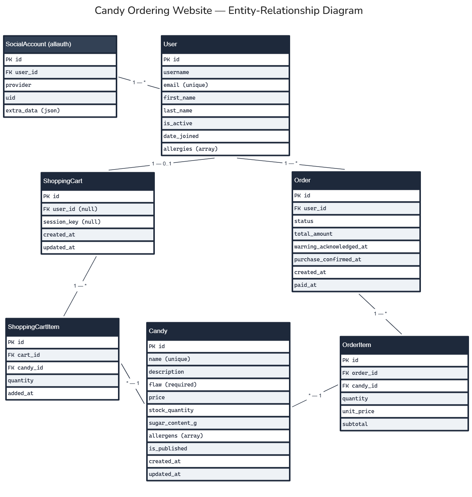

# Candy Ordering Website

Data Model Specification — Entity\-Relationship Model

|  |  |
| --- | --- |
| **Status** | Draft |
| **Version** | 0\.1 |
| **Date** | 2026\-09\-08 |
| **Database** | PostgreSQL |
| **ORM** | Django ORM (Django \+ Django REST Framework) |
| **Notation** | Entity\-Relationship Diagram (ERD) — the current, most widely used notation for relational data models |

## 1\. Overview

This document defines the data model for the Candy Ordering Website: the entities behind the Candy catalog, User accounts, the Cart, and Orders, and how they relate. It follows the entities named in the requirements specification (Candy, User, Cart, Order) and expands each into join tables where the relationship is many\-to\-many in practice (Cart–Candy via `CartItem`, Order–Candy via `OrderItem`).

The model assumes Django's ORM mapped onto PostgreSQL, so it uses PostgreSQL\-specific field types (`ArrayField`) where they are a natural fit, consistent with the earlier decision to use PostgreSQL for its native array and JSON support.

## 2\. Entity\-Relationship Diagram

Diagram source: [`erd.excalidraw`](erd.excalidraw) — re\-export to `erd.png` after editing.

Boxes are entities (tables); each line's end labels give cardinality (`1`, `0..1`, `*`). `SocialAccount` is provided by django\-allauth rather than defined by this project.

## 3\. Entity Definitions

### 3\.1 User

Django's built\-in user model, as extended by django\-allauth for social/federated login.

| Field | Type | Constraints | Notes |
| --- | --- | --- | --- |
| id | BigAutoField | PK |  |
| username | CharField | unique | Populated automatically on social sign\-up. |
| email | EmailField | unique, not null | Primary identifier used across the app. |
| first\_name | CharField | nullable |  |
| last\_name | CharField | nullable |  |
| is\_active | Boolean | default true |  |
| date\_joined | DateTimeField | auto, not null |  |

### 3\.2 SocialAccount *(django\-allauth, reference only)*

| Field | Type | Constraints | Notes |
| --- | --- | --- | --- |
| id | BigAutoField | PK |  |
| user\_id | ForeignKey → User | not null | One User can have several linked providers. |
| provider | CharField | not null | e.g. `google`. |
| uid | CharField | not null | Provider\-issued identifier. |
| extra\_data | JSONField | nullable | Raw profile payload from the provider. |

### 3\.3 Profile

One\-to\-one extension of User for domain\-specific fields not part of authentication.

| Field | Type | Constraints | Notes |
| --- | --- | --- | --- |
| id | BigAutoField | PK |  |
| user\_id | OneToOneField → User | unique, not null |  |
| allergies | ArrayField(CharField) | nullable, default empty | PostgreSQL array; supports the checkout warning (see requirements UC\-07). |
| created\_at | DateTimeField | auto |  |
| updated\_at | DateTimeField | auto |  |

### 3\.4 Candy

| Field | Type | Constraints | Notes |
| --- | --- | --- | --- |
| id | BigAutoField | PK |  |
| name | CharField | unique, not null |  |
| slug | SlugField | unique, not null | Used in catalog/detail URLs. |
| description | TextField | not null | Shown on the detail view (UC\-03). |
| flaw | TextField | **not null** | Mandatory design/feature downside (UC\-06) — enforced at the model level, not just the UI. |
| price | DecimalField | not null |  |
| stock\_quantity | PositiveIntegerField | not null, default 0 | Checked on every Cart mutation and at checkout. |
| sugar\_content\_g | DecimalField | nullable | Feeds the checkout health warning (UC\-07). |
| allergens | ArrayField(CharField) | default empty | PostgreSQL array; cross\-referenced against `Profile.allergies`. |
| is\_published | Boolean | default true | Unpublished items are hidden from the catalog. |
| created\_at | DateTimeField | auto |  |
| updated\_at | DateTimeField | auto |  |

### 3\.5 Cart

| Field | Type | Constraints | Notes |
| --- | --- | --- | --- |
| id | BigAutoField | PK |  |
| user\_id | ForeignKey → User | nullable, unique | Null supports a guest cart; unique enforces one active cart per User. |
| session\_key | CharField | nullable | Identifies a guest Cart before login. |
| created\_at | DateTimeField | auto |  |
| updated\_at | DateTimeField | auto |  |

### 3\.6 CartItem

Join table resolving the many\-to\-many relationship between Cart and Candy.

| Field | Type | Constraints | Notes |
| --- | --- | --- | --- |
| id | BigAutoField | PK |  |
| cart\_id | ForeignKey → Cart | not null |  |
| candy\_id | ForeignKey → Candy | not null |  |
| quantity | PositiveIntegerField | not null, default 1 |  |
| added\_at | DateTimeField | auto |  |
| *(cart\_id, candy\_id)* | — | unique together | One row per Candy per Cart; quantity holds the count. |

### 3\.7 Order

| Field | Type | Constraints | Notes |
| --- | --- | --- | --- |
| id | BigAutoField | PK |  |
| user\_id | ForeignKey → User | not null |  |
| status | CharField (choices) | not null | `pending`, `paid`, `cancelled`, `fulfilled`. |
| total\_amount | DecimalField | not null | Snapshot total at order creation. |
| warning\_acknowledged\_at | DateTimeField | nullable | Timestamp of the UC\-07 health\-warning acknowledgment. |
| purchase\_confirmed\_at | DateTimeField | nullable | Timestamp of the final UC\-08 confirmation. |
| created\_at | DateTimeField | auto |  |
| paid\_at | DateTimeField | nullable | Set once payment succeeds. |

### 3\.8 OrderItem

Join table resolving the many\-to\-many relationship between Order and Candy, with a price snapshot.

| Field | Type | Constraints | Notes |
| --- | --- | --- | --- |
| id | BigAutoField | PK |  |
| order\_id | ForeignKey → Order | not null |  |
| candy\_id | ForeignKey → Candy | not null |  |
| quantity | PositiveIntegerField | not null |  |
| unit\_price | DecimalField | not null | Price at the time of purchase — Candy's own price may change later. |
| subtotal | DecimalField | not null | `quantity × unit_price`, stored rather than recomputed. |

## 4\. Relationship Summary

| Relationship | Cardinality | Enforced By |
| --- | --- | --- |
| User – SocialAccount | 1 : \* | django\-allauth |
| User – Profile | 1 : 0..1 | `Profile.user_id` (unique FK) |
| User – Cart | 1 : 0..1 | `Cart.user_id` (unique, nullable FK) |
| User – Order | 1 : \* | `Order.user_id` |
| Cart – Candy | \* : \* | via `CartItem` |
| Order – Candy | \* : \* | via `OrderItem` |

## 5\. Design Notes

- The **Flaw** field on Candy is modeled as `NOT NULL` specifically so the requirement that every candy discloses a downside (UC\-06) is a database\-level guarantee, not just a form validation.
- **Allergens** (Candy) and **allergies** (Profile) are both PostgreSQL `ArrayField`s rather than a normalized join table, reflecting the ADR decision to use PostgreSQL for its native array/JSON support on small, list\-like attributes.
- **CartItem** and **OrderItem** exist because Cart–Candy and Order–Candy are genuinely many\-to\-many relationships (a candy appears in many carts/orders and a cart/order holds many candies); `quantity` and, for orders, a `unit_price` snapshot live on the join table rather than on either parent.
- **Cart.user\_id** is nullable to leave room for a guest cart keyed by `session_key`, matching the open question in the requirements specification about whether guest checkout is supported.
